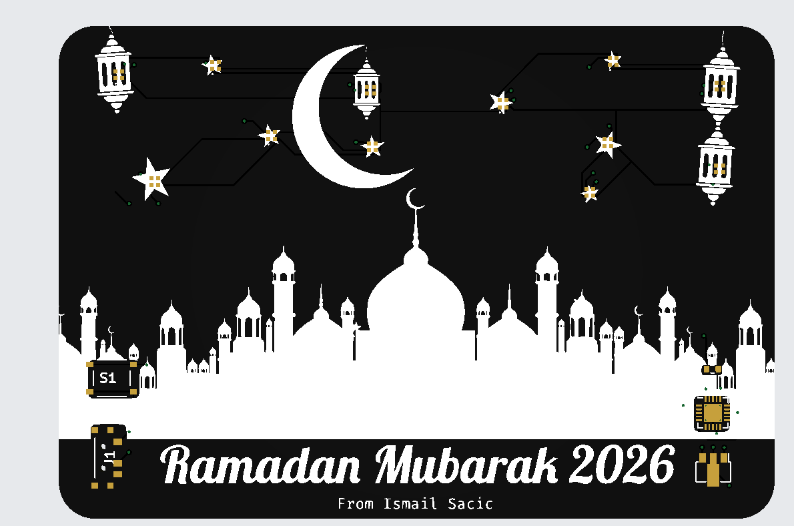
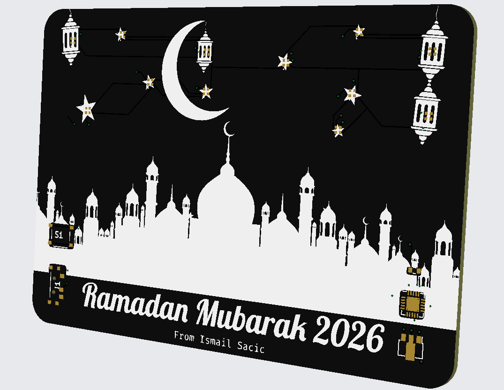
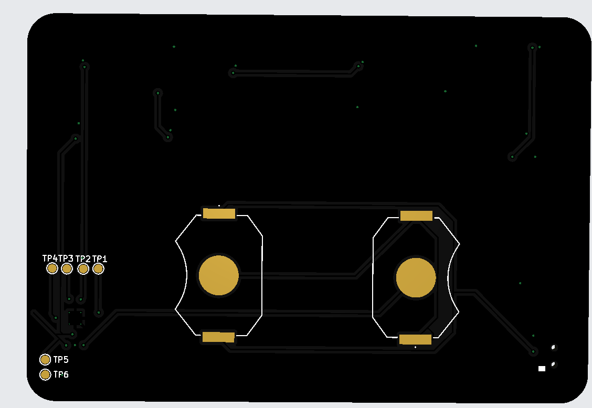

# Digital Ramadan Cards Project

**By Ismail Sacic**

Welcome to the Digital Ramadan Cards project! This repository contains the design and source files for creating unique, digital printed circuit board (PCB) cards specifically designed for Ramadan.

## Project Overview

I am creating digital Ramadan cards that combine traditional aesthetics with modern electronics. These cards are designed using KiCad and can be manufactured as PCBs. They serve as beautiful, tech-inspired gifts or decorative pieces to celebrate the holy month of Ramadan.

### Features
- **Design Year**: 2026
- **Format**: KiCad PCB Design
- **Custom Graphics**: Includes custom silk screen art (Mosque/Stars).

## Preview

Here are some preview images of the 2026 card design:

## Repository Structure

- `2026/` : Contains the KiCad project files for the 2026 edition.
  - `gr/` : Gerber files for manufacturing.
  - `Graphics/` : Custom footprints and graphics used on the PCB.
  - `preview/` : Images of the design.

## How to Open

1. Install [KiCad](https://www.kicad.org/).
2. Open the `.kicad_pro` file located in the `2026/` directory.

## License

**Copyright © 2026 Ismail Sacic. All Rights Reserved.**

This project is for personal viewing only. **You are not allowed to manufacture, produce, or sell** cards based on this design. See the [LICENSE](LICENSE) file for more details.
